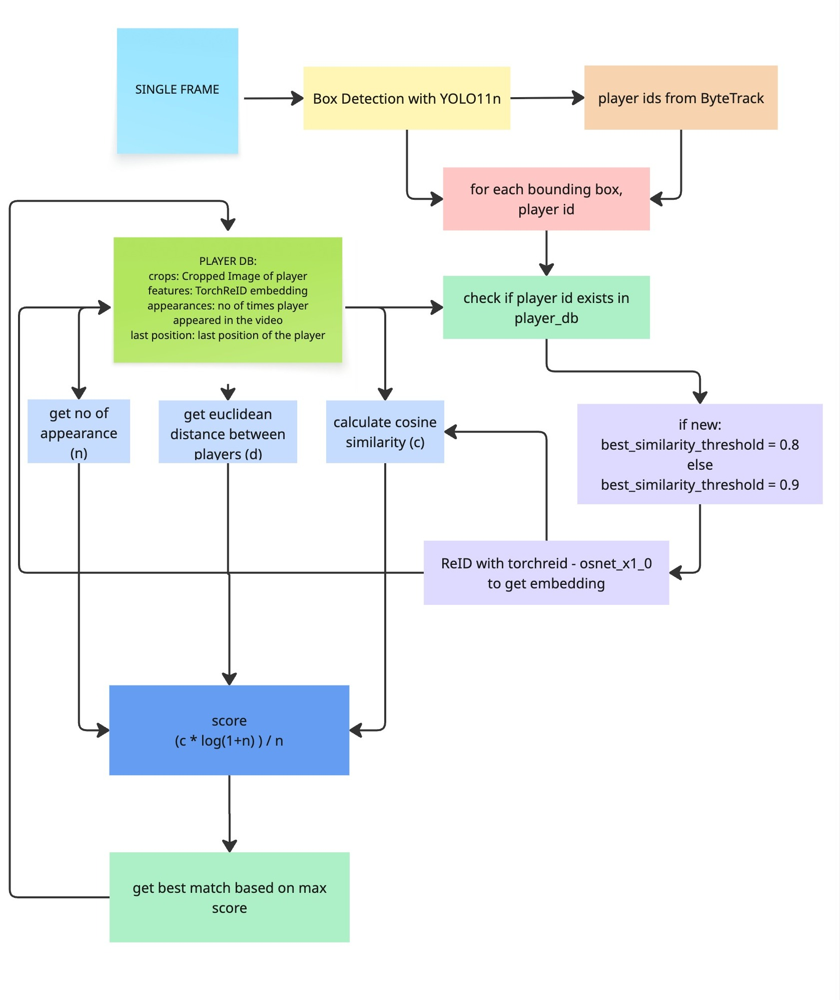
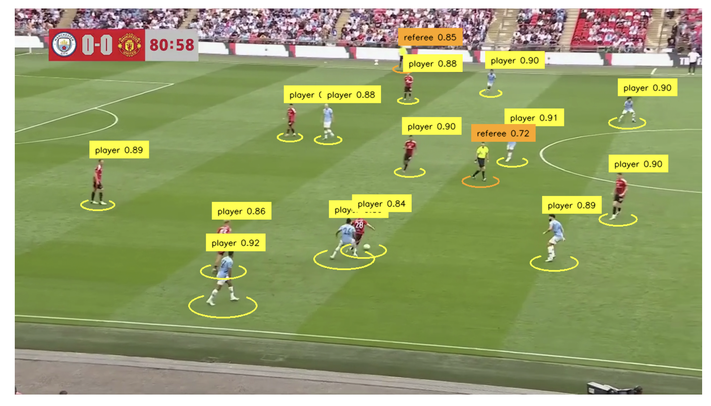
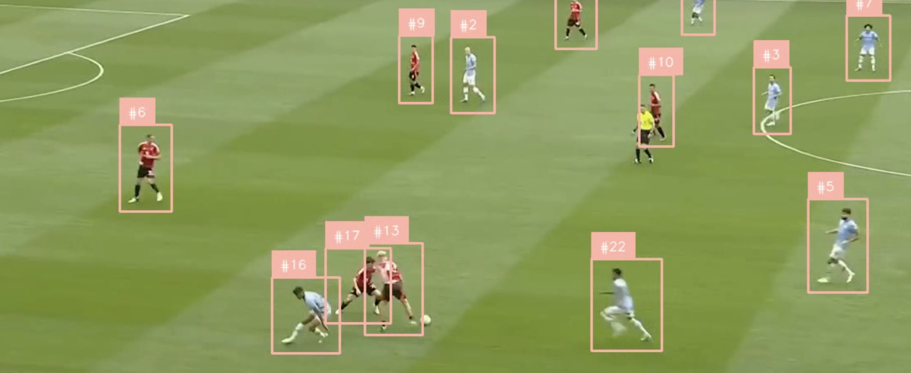
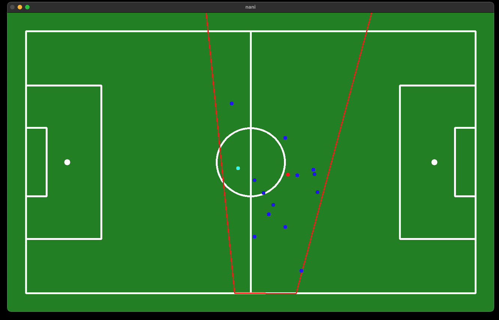
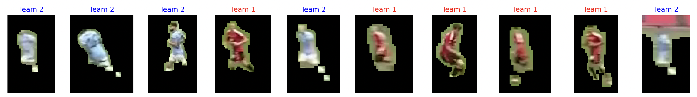

# Football Player Tracking

A computer vision pipeline for detecting, identifying, and continuously tracking football players across video frames using **YOLOv11** and **TorchReID**.

At each frame, the system detects all players using YOLO, extracts their visual appearance embeddings using a ReID model, and links identities across frames to create smooth and accurate player tracks.

# Algoritm


## Results


---
##  Project Details

This project combines modern deep learning and computer vision techniques to create a robust football player tracking system. Below is a detailed breakdown of the key components:

---

### Player Detection

- Utilizes a **finetuned YOLOv11**  model trained specifically to detect four distinct object classes:
  - `player`
  - `goalkeeper`
  - `referee`
  - `ball`
- The model achieves accurate and real-time object localization using bounding boxes, making it ideal for fast-paced sports footage.
- Fine-tuning was performed on custom football datasets to boost recognition accuracy in real-game environments.

---

### Player Tracking (ByteTrack)

- Tracking is handled by **ByteTrack**, a high-performance multi-object tracking (MOT) algorithm known for preserving identities even during occlusion.
- ByteTrack processes all detection confidence levels, including low-confidence detections that are often ignored by other trackers.
- The integration of ByteTrack ensures stable, frame-to-frame tracking even when players overlap or leave the frame momentarily.
        
---

### Re-Identification (ReID)

- Each detected player is passed through a **ReID embedding model** (`osnet_x1_0`) provided by [TorchReID](https://github.com/KaiyangZhou/deep-person-reid).
- The ReID model extracts unique visual features (e.g. jersey color, body shape, posture) for each player crop.
- This embedding is then used to **relabel and match players** across disjoint tracks, even if ByteTrack temporarily loses track due to occlusion or motion blur.
- It ensures long-term identity consistency — for example, Player #6 remains Player #6 throughout the game.
- 

---

### Multi-Frame Identity Consistency

- The system fuses **appearance-based matching (ReID)** with **spatial tracking (ByteTrack)** to keep player IDs stable over many frames.
- Smart heuristics detect re-entries and restore the same ID based on feature similarity.
- This hybrid strategy balances accuracy and speed.
 - `score = similarity * math.log(1 + appearances) * distance_score`

---

### Homographic Projection

- To convert pixel-based positions into a **top-down bird’s-eye view**, a **homography matrix** is estimated.
- This transformation aligns video coordinates with a known reference plane (e.g. football pitch dimensions).
  

---

### Team Detection & Clustering

- A lightweight **color-based segmentation** is applied to separate players by team:
  - Green background is filtered out using HSV color thresholds.
  - Remaining pixels median is calculated and are clustered using **Gaussian Mixture Models (GMM)** into two teams.
- The method is unsupervised, fast, and works with various jersey colors, as long as they contrast with the background and each other.
  

---


## Getting Started
Follow these steps to set up the project locally:

### Requirements
- Python 3.12 or higher


### 1. Clone the repository
```sh
git clone https://github.com/Almightyoo/Football-Analytics.git
cd Football-Analytics
```

### 2. Set up Python Environment
```sh
python -m venv venv
source venv/bin/activate # for macOS/Linux

pip install -r requirements.txt

```
### 3. Model and Assets Link
- [Link to Model and assests](https://drive.google.com/drive/folders/1VAzygoEnSoDvWJQ2JVrM6O-O4Q7k5rm0?usp=sharing)


### 4. Run the Model
```sh
python3 run src/main_tracking.py
```


---


